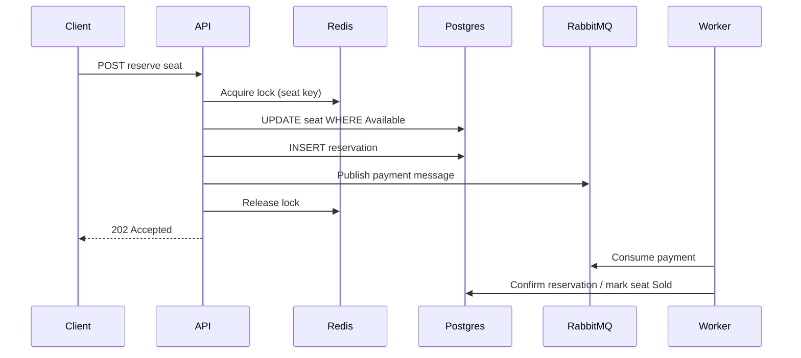

# HAGSS — High Availability Global Scheduling System

Seat reservation API designed for high throughput while preventing double booking of the same seat.

> Portuguese documentation: [README.pt-BR.md](README.pt-BR.md)

## Architecture

- **ASP.NET Core 10 Minimal APIs** — low-overhead HTTP endpoints for reservations
- **PostgreSQL + EF Core** — durable seat and reservation state with optimistic concurrency (`RowVersion`) and a partial unique index on active reservations
- **Redis distributed locks** — per-seat locks so concurrent requests serialize before the database write
- **RabbitMQ** — asynchronous payment processing after a reservation is created
- **Polly** — retry policies for RabbitMQ publish and simulated payment gateway calls

### Reservation flow



## Requirements

- [Docker](https://www.docker.com/) and Docker Compose
- Optional: [.NET 10 SDK](https://dotnet.microsoft.com/download) for local development without Docker

## Run with Docker Compose

From the repository root:
```bash
docker compose up --build
```

| Service        | URL / port                          |
|----------------|-------------------------------------|
| API            | http://localhost:8080               |
| **Monitor UI** | **http://localhost:8081**           |
| Load simulator | background worker (no public port)  |
| Health         | http://localhost:8080/health        |
| OpenAPI        | http://localhost:8080/openapi/v1.json (Development) |
| RabbitMQ       | Management UI http://localhost:15672 (`hagss` / `hagss`) |
| PostgreSQL     | `localhost:5432`                    |
| Redis          | `localhost:6379`                    |

The **load simulator** (`HAGSS.LoadSimulator`) starts after the API is healthy and runs continuous rounds. Each round picks a random number of users between 1 and 1000, assigns random timezones, and fires reservation requests against the sample event—with high probability of targeting the same “hot” seats to trigger race conditions.

The **monitor** (`HAGSS.Monitor`) is a Blazor Server dashboard with real-time updates via SignalR (`/hubs/reservations`): live event feed, counters, and **available** vs **confirmed** seat lists (plus pending-payment count).

On first startup the API applies EF migrations and seeds a sample event with 200 seats.

Sample event ID: `11111111-1111-1111-1111-111111111111`

## API examples

List events:

```bash
curl http://localhost:8080/api/events
```

List seats for the sample event:

```bash
curl http://localhost:8080/api/events/11111111-1111-1111-1111-111111111111/seats
```

Reserve a seat (replace `{seatId}` with an available seat from the list):

```bash
curl -X POST "http://localhost:8080/api/events/11111111-1111-1111-1111-111111111111/seats/{seatId}/reserve" \
  -H "Content-Type: application/json" \
  -d '{"customerEmail":"user@example.com"}'
```

Check reservation status:

```bash
curl http://localhost:8080/api/reservations/{reservationId}
```

## Race condition protection

Three layers work together:

1. **Redis lock** — `lock:seat:{eventId}:{seatId}` ensures only one reservation attempt runs the critical section at a time per seat.
2. **Conditional update** — `UPDATE` only when `Status = Available` avoids overwriting an already reserved seat.
3. **Database unique index** — at most one active reservation (`PendingPayment` or `Confirmed`) per seat.

Under concurrent load, duplicate sales return `409 Conflict` or `429 Too Many Requests` instead of selling the same seat twice.

## Local development (without Docker)

Start PostgreSQL, Redis, and RabbitMQ (or use Compose for infrastructure only):

```bash
docker compose up postgres redis rabbitmq -d
dotnet run --project HAGSS
dotnet run --project HAGSS.Monitor
dotnet run --project HAGSS.LoadSimulator
```

## Solution projects

| Project | Description |
|---------|-------------|
| `HAGSS` | Reservation API (Minimal APIs, EF Core, Redis, RabbitMQ) |
| `HAGSS.Contracts` | Shared DTOs for activity events (API ↔ Monitor) |
| `HAGSS.LoadSimulator` | Worker that simulates 1–1000 concurrent users per round |
| `HAGSS.Monitor` | Blazor Server UI for real-time observability |

## Project structure

```
HAGSS/                    # API
├── Data/
├── Endpoints/
├── Hubs/                 # SignalR reservation activity hub
├── Infrastructure/
├── Services/
└── Workers/

HAGSS.LoadSimulator/      # Load test worker
HAGSS.Monitor/            # Live dashboard (Blazor Server)
HAGSS.Contracts/          # Shared event contracts
```

## Configuration

Connection strings and tuning are in `HAGSS/appsettings.json`. In Docker Compose they are overridden via environment variables (`ConnectionStrings__Postgres`, etc.).
