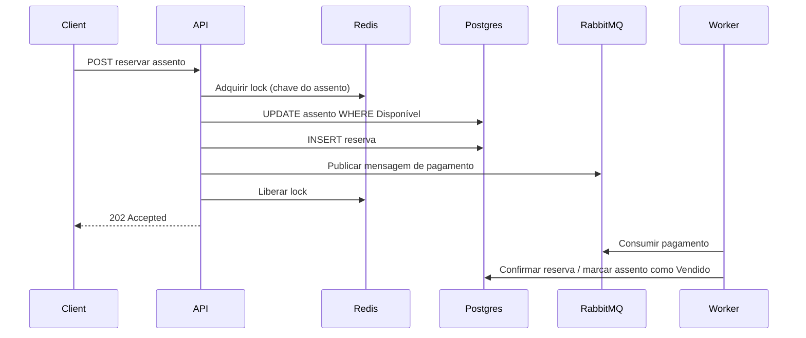

# HAGSS — High Availability Global Scheduling System

API de reserva de assentos pensada para alto volume de requisições, evitando a venda duplicada do mesmo assento.

> Documentação em inglês: [README.md](README.md)

## Arquitetura

- **ASP.NET Core 10 Minimal APIs** — endpoints HTTP enxutos para reservas
- **PostgreSQL + EF Core** — estado durável de assentos e reservas, com concorrência otimista (`RowVersion`) e índice único parcial em reservas ativas
- **Redis (distributed lock)** — bloqueio por assento para serializar requisições concorrentes antes da gravação no banco
- **RabbitMQ** — processamento assíncrono de pagamentos após a criação da reserva
- **Polly** — políticas de retry no publish do RabbitMQ e nas chamadas simuladas ao gateway de pagamento

### Fluxo de reserva



## Requisitos

- [Docker](https://www.docker.com/) e Docker Compose
- Opcional: [.NET 10 SDK](https://dotnet.microsoft.com/download) para desenvolvimento local sem Docker

## Executar com Docker Compose

Na raiz do repositório:

```bash
docker compose up --build
```

| Serviço           | URL / porta                         |
|-------------------|-------------------------------------|
| API               | http://localhost:8080               |
| **Monitor (UI)**  | **http://localhost:8081**           |
| Simulador de carga| worker em segundo plano (sem porta) |
| Health            | http://localhost:8080/health        |
| OpenAPI           | http://localhost:8080/openapi/v1.json (Development) |
| RabbitMQ          | UI de gestão http://localhost:15672 (`hagss` / `hagss`) |
| PostgreSQL        | `localhost:5432`                    |
| Redis             | `localhost:6379`                    |

O **simulador de carga** (`HAGSS.LoadSimulator`) inicia após a API ficar saudável e executa rodadas contínuas. Em cada rodada, escolhe aleatoriamente entre **1 e 1000 usuários**, atribui fusos horários variados e dispara requisições de reserva no evento de exemplo — com alta probabilidade de mirar os mesmos **assentos “quentes”** para provocar condições de corrida.

O **monitor** (`HAGSS.Monitor`) é um painel Blazor Server com atualização em tempo real via SignalR (`/hubs/reservations`): feed de eventos, contadores, listas de assentos **disponíveis** e **confirmados** (vendidos), além de assentos com pagamento pendente.

Na primeira subida, a API aplica as migrations do EF e cria um evento de exemplo com 200 assentos.

ID do evento de exemplo: `11111111-1111-1111-1111-111111111111`

## Exemplos de API

Listar eventos:

```bash
curl http://localhost:8080/api/events
```

Listar assentos do evento de exemplo:

```bash
curl http://localhost:8080/api/events/11111111-1111-1111-1111-111111111111/seats
```

Reservar um assento (substitua `{seatId}` por um assento disponível da lista):

```bash
curl -X POST "http://localhost:8080/api/events/11111111-1111-1111-1111-111111111111/seats/{seatId}/reserve" \
  -H "Content-Type: application/json" \
  -d '{"customerEmail":"user@example.com"}'
```

Consultar status da reserva:

```bash
curl http://localhost:8080/api/reservations/{reservationId}
```

## Proteção contra condição de corrida

Três camadas atuam em conjunto:

1. **Lock no Redis** — `lock:seat:{eventId}:{seatId}` garante que apenas uma tentativa de reserva execute a seção crítica por assento por vez.
2. **Update condicional** — `UPDATE` somente quando `Status = Available` evita sobrescrever um assento já reservado.
3. **Índice único no banco** — no máximo uma reserva ativa (`PendingPayment` ou `Confirmed`) por assento.

Sob carga concorrente, vendas duplicadas resultam em `409 Conflict` ou `429 Too Many Requests`, em vez de vender o mesmo assento duas vezes.

## Desenvolvimento local (sem Docker completo)

Suba apenas a infraestrutura com Compose:

```bash
docker compose up postgres redis rabbitmq -d
dotnet run --project HAGSS
dotnet run --project HAGSS.Monitor
dotnet run --project HAGSS.LoadSimulator
```

## Projetos da solution

| Projeto | Descrição |
|---------|-----------|
| `HAGSS` | API de reservas (Minimal APIs, EF Core, Redis, RabbitMQ) |
| `HAGSS.Contracts` | DTOs compartilhados de eventos de atividade (API ↔ Monitor) |
| `HAGSS.LoadSimulator` | Worker que simula 1–1000 usuários concorrentes por rodada |
| `HAGSS.Monitor` | UI Blazor Server para observabilidade em tempo real |

## Estrutura do repositório

```
HAGSS/                    # API
├── Data/
├── Endpoints/
├── Hubs/                 # Hub SignalR de atividade de reservas
├── Infrastructure/
├── Services/
└── Workers/

HAGSS.LoadSimulator/      # Worker de teste de carga
HAGSS.Monitor/            # Painel ao vivo (Blazor Server)
HAGSS.Contracts/          # Contratos compartilhados de eventos
```

## Configuração

Connection strings e ajustes finos estão em `HAGSS/appsettings.json`. No Docker Compose, são sobrescritos por variáveis de ambiente (`ConnectionStrings__Postgres`, etc.).

Variáveis do simulador: prefixo `Simulator__` (ex.: `Simulator__MaxUsers`).  
Variáveis do monitor: prefixo `Monitor__` (ex.: `Monitor__ApiBaseUrl`).
